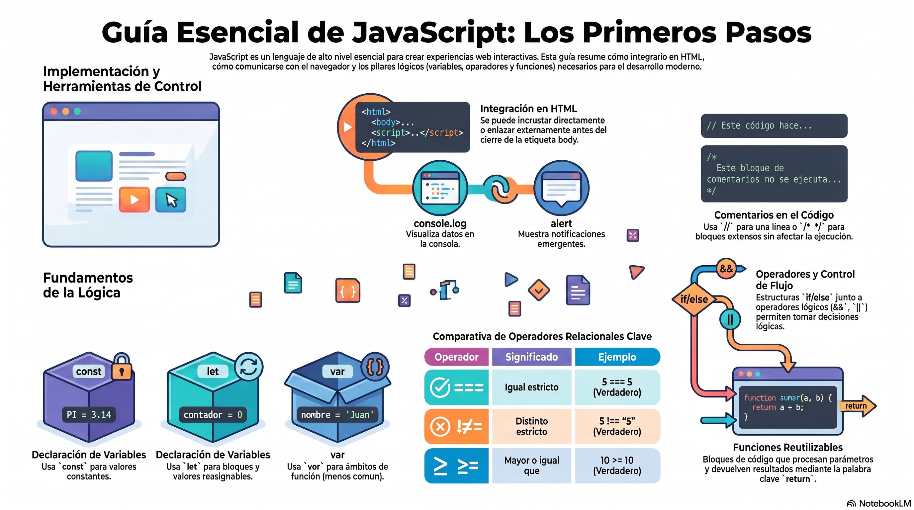

# Semana 1 – Identificando los elementos básicos para trabajar con JavaScript

> **Carrera:** Desarrollo y Diseño Web | **Asignatura:** Lenguajes Interactivos
> **Experiencia:** 1 – Semana 1

---

## Introducción

En el mundo de la programación web, JavaScript es una de las herramientas esenciales para dar vida a aplicaciones interactivas y dinámicas. Es un lenguaje **de alto nivel**, diseñado para ser comprensible y legible por los humanos, en contraste con los lenguajes de bajo nivel que están más cerca de la representación de la máquina.

JavaScript se ejecuta en el navegador web del usuario. Su propósito principal es mejorar la experiencia del usuario, permitiendo la interacción en tiempo real y la manipulación de contenido sin necesidad de recargar la página. También es la base de frameworks como React y Angular.

[Descargar presentación](material-clase/presentacion.pdf)
---

## Resultado de aprendizaje

**RA1.** Utiliza elementos básicos de programación en JavaScript en sitio web, de acuerdo con los criterios de usabilidad, accesibilidad y requerimientos del proyecto.

### Indicadores de logro

| Código | Descripción |
|--------|-------------|
| **IL1** | Utiliza correctamente variables, arrays, operadores (`if - else`) y bucles para dar solución a los requerimientos del proyecto. |
| **IL2** | Utiliza JavaScript para programar funciones que permiten reutilizar código de manera eficiente. |

---

## Conceptos relevantes

| Variables | Tipos de datos | Funciones | Condicionales | Objetos |
|-----------|---------------|-----------|--------------|---------|

---

## Preguntas activadoras

- ¿Te gustaría hacer tu propia aplicación web desde cero?
- ¿Quieres crear sitios web dinámicos e interactivos?
- ¿Has pensado en tener una carrera versátil en desarrollo web?

---

## Actividad formativa

Aplicar conocimientos de variables, operadores condicionales y funciones para resolver dos ejercicios prácticos:
1. Uso de **condicionales**.
2. Uso de **funciones**.

---

## Comenzando a trabajar con JavaScript

El código JavaScript puede insertarse en un documento HTML de dos maneras:

### Incrustado directamente (entre etiquetas `<script>`)

```html
<!DOCTYPE html>
<html lang="es">
<head>
  <meta charset="UTF-8">
  <meta name="viewport" content="width=device-width, initial-scale=1.0">
  <title>Mi Página Web</title>
</head>
<body>
  <p>Contenido de la página.</p>
  <script>
    // Tu código de JavaScript aquí
    alert("¡Hola mundo!");
  </script>
</body>
</html>
```

### Enlazado externamente (archivo `.js` separado)

```html
<body>
  <p>Contenido de la página.</p>
  <script src="mi-script.js"></script>
</body>
```

> **Buena práctica:** colocar la etiqueta `<script>` al final del `<body>` para que el navegador cargue y muestre el HTML antes de ejecutar el JavaScript.

---

## Escribir en la consola

La consola permite imprimir mensajes y ver valores de variables, errores y datos en tiempo de ejecución. Se accede a través del objeto `console`.

### Métodos más comunes

| Método | Descripción |
|--------|-------------|
| `console.log()` | Muestra un mensaje o valor en la consola |
| `console.warn()` | Muestra un mensaje de advertencia |
| `console.error()` | Muestra un mensaje de error |
| `console.info()` | Muestra un mensaje informativo |
| `console.table()` | Muestra datos en formato tabla |
| `console.group()` / `groupEnd()` | Agrupa mensajes relacionados |

```js
let nombre = "Juan";
let edad = 30;

console.log("nombre:", nombre);
console.log("Edad:", edad);
```

### Cómo abrir la consola en Chrome

- **Opción 1:** `Ctrl + Shift + J` (Windows) o `Cmd + Option + J` (Mac)
- **Opción 2:** Clic derecho → **Inspeccionar** → pestaña **Consola**

---

## Alertas

Las alertas son ventanas emergentes que muestran mensajes o notificaciones al usuario.

```js
alert("Mensaje de la alerta");
```

### Usos principales

- **Notificar** al usuario sobre situaciones importantes.
- **Solicitar confirmación** antes de realizar una acción crítica.
- **Mostrar mensajes de error** o advertencia.
- **Proporcionar información adicional** sobre una característica del sitio.

---

## Comentarios

Los comentarios son anotaciones en el código que no afectan su ejecución.

### Comentario de una línea

```js
// Este es un comentario de una línea
```

### Comentario de múltiples líneas

```js
/*
  Este es un comentario de múltiples líneas.
  Puede abarcar varias líneas y es útil para
  explicar secciones de código más extensas.
*/
```

> Los comentarios son una buena práctica para hacer el código más legible y comprensible.

---

## Variables

Las variables son contenedores para almacenar datos (números, cadenas de texto, objetos, etc.). Se declaran con `var`, `let` o `const`.

### Diferencias clave: `var`, `let` y `const`

| Característica | `var` | `let` | `const` |
|---------------|-------|-------|---------|
| Ámbito | Función | Bloque | Bloque |
| Reasignable | Sí | Sí | No |
| Uso recomendado | No (código legacy) | Sí | Sí (valores fijos) |

### Declaración con `var` (ámbito de función)

```js
var edad = 25;
```

> **Importante:** `25` (número) es distinto de `'25'` (cadena de texto).

### Declaración con `let` (ámbito de bloque)

```js
let nombre = "juan";
// Puede ser reasignada
nombre = "Pedro";
```

### Declaración con `const` (inmutable)

```js
const PI = 3.1416;
// No puede ser reasignada después de su declaración
```

> La elección entre `var`, `let` o `const` depende del ámbito y de si se planea reasignar el valor.

---

## Tipos de datos

JavaScript es un lenguaje con **tipado dinámico**: las variables pueden cambiar de tipo durante la ejecución.

| Tipo | Descripción | Ejemplo |
|------|-------------|---------|
| **Number** | Valores numéricos (enteros o decimales) | `44`, `3.14` |
| **String** | Cadenas de texto | `"Hola"` |
| **Boolean** | Verdadero o falso | `true`, `false` |
| **null** | Ausencia intencional de un valor | `null` |
| **Object** | Colección de propiedades y valores | `{ nombre: "Ana" }` |
| **Array** | Lista ordenada de valores | `[1, 2, 3]` |

---

## Operadores

### Operadores condicionales (`if`, `else if`, `else`)

Permiten que el programa tome decisiones basadas en condiciones:

```js
var miVariable = 1;

if (miVariable === 1) {
    console.log(true);  // se ejecuta si miVariable es 1
} else {
    console.log(false); // se ejecuta en cualquier otro caso
}
```

### Operadores relacionales

| Símbolo | Operador | ¿Qué hace? |
|---------|----------|-----------|
| `==` | Igual | Compara valor (con coerción de tipo). `5 == "5"` → `true` |
| `===` | Igual estricto | Compara valor Y tipo. `5 === "5"` → `false` |
| `!=` | Distinto | Diferente en valor. `5 != "6"` → `true` |
| `!==` | Distinto estricto | Diferente en valor o tipo. `5 !== "5"` → `true` |
| `>` | Mayor que | `10 > 5` → `true` |
| `<` | Menor que | `5 < 10` → `true` |
| `>=` | Mayor o igual que | `10 >= 10` → `true` |
| `<=` | Menor o igual que | `10 <= 10` → `true` |

### Operadores lógicos

| Operador | Nombre | Se cumple cuando... |
|----------|--------|---------------------|
| `&&` | AND | Todas las condiciones son verdaderas |
| `\|\|` | OR | Al menos una condición es verdadera |
| `!` | NOT | Niega la condición |

```js
// AND: ambas condiciones deben ser verdaderas
if (condicion1 && condicion2) { /* ... */ }

// OR: al menos una debe ser verdadera
if (condicion1 || condicion2) { /* ... */ }

// NOT: se cumple si la condición original es falsa
if (!condicion) { /* ... */ }

// Combinado
if ((condicion1 || condicion2) && !(condicion1 && condicion2)) { /* ... */ }
```

---

## Funciones

Las funciones son **bloques de código reutilizable** que realizan una tarea específica. Se definen con la palabra clave `function`.

### Sintaxis

```js
function nombreDeLaFuncion(parametro1, parametro2) {
    // Código a ejecutar
    // Puedes usar los parámetros aquí
    return resultado; // Opcional: devuelve un valor
}
```

### Partes de una función

| Elemento | Descripción |
|----------|-------------|
| `function` | Palabra clave que declara la función |
| `nombreDeLaFuncion` | Nombre elegido para identificarla |
| `(parametro1, ...)` | Valores de entrada (opcionales) |
| `{ ... }` | Cuerpo con las instrucciones a ejecutar |
| `return` | Devuelve un valor al lugar donde se llamó |

### Ejemplo: función con parámetro

```js
function saludar(nombre) {
    console.log("¡Hola, " + nombre + "!");
}

saludar("Juan"); // Imprimirá "¡Hola, Juan!"
```

### Ejemplo: función con `return`

```js
function suma(a, b) {
    let resultado = a + b;
    return resultado;
}

let resultadoSuma = suma(5, 3);
console.log(resultadoSuma); // Imprimirá 8
```

> Las funciones son útiles para reutilizar código, dividir tareas en partes más pequeñas y facilitar el mantenimiento del programa.

---

## Cierre de la semana

Durante esta semana se aprendió a:

- Agregar JavaScript en una página web, ya sea **incrustado** o **enlazado externamente**.
- Usar la **consola**, las **alertas** y los **comentarios** para interactuar y documentar el código.
- Declarar **variables** con `var`, `let` y `const`, comprendiendo sus diferencias de ámbito y mutabilidad.
- Usar **operadores relacionales** (`==`, `===`, `>`, `<`, etc.) y **lógicos** (`&&`, `||`, `!`).
- Crear **funciones** con parámetros y devolver valores con `return`.

---

## ¿Cómo usar este material?

### Opción 1: consola del navegador
1. Abre cualquier página en el navegador.
2. Presiona `F12` o clic derecho → **Inspeccionar**.
3. Ve a la pestaña **Console**.
4. Copia y pega fragmentos de código para revisar los ejemplos.

### Opción 2: vincular `main.js` desde un HTML

```html
<!DOCTYPE html>
<html lang="es">
<head>
  <meta charset="UTF-8" />
  <meta name="viewport" content="width=device-width, initial-scale=1.0" />
  <title>Clase 01</title>
</head>
<body>
  <h1>Clase 01 - JavaScript</h1>
  <script src="./assets/js/main.js"></script>
</body>
</html>
```

---

## Archivos incluidos

- `index.html`: página de apoyo para vincular el script.
- `assets/js/main.js`: clase completa con ejemplos comentados paso a paso.

---

## Referencias

- MDN Web Docs – [JavaScript](https://developer.mozilla.org/es/docs/Web/JavaScript)
- JavaScript.info – [El Tutorial de JavaScript Moderno](https://es.javascript.info/)
- W3Schools – [JavaScript Introduction](https://www.w3schools.com/js/js_intro.asp)
- Flanagan, D. *JavaScript: The Definitive Guide*. O'Reilly Media, Inc.
