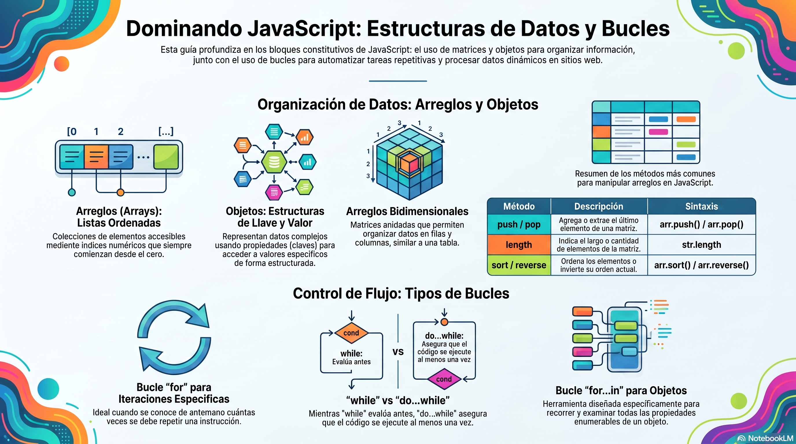

# Semana 2 – Profundizando en el control de JavaScript

> **Carrera:** Desarrollo y Diseño Web | **Asignatura:** Lenguajes Interactivos
> **Experiencia:** 1 – Semana 2

---

## Introducción

La semana anterior se revisaron las bases de JavaScript: variables, operadores condicionales y funciones. Esta semana se completan los bloques constitutivos del lenguaje explorando el uso de **arreglos (arrays)** y **bucles**, para desarrollar los primeros programas que resuelvan problemas en un contexto real.

[Descargar presentación](material-clase/presentacion.pdf)
---

## Resultado de aprendizaje

**RA1.** Utiliza elementos básicos de programación en JavaScript en sitio web, de acuerdo con los criterios de usabilidad, accesibilidad y requerimientos del proyecto.

### Indicadores de logro

| Código | Descripción |
|--------|-------------|
| **IL1** | Utiliza correctamente variables, arrays, operadores (`if - else`) y bucles para dar solución a los requerimientos del proyecto. |
| **IL2** | Utiliza JavaScript para programar funciones que permiten reutilizar código de manera eficiente. |

---

## Conceptos relevantes

| Bucles | Arreglos | Objetos | Eventos | Enumerable |
|--------|----------|---------|---------|------------|

---

## Preguntas activadoras

- ¿Conoces la ventaja de utilizar **arrays y bucles** en la manipulación de datos de formularios en un sitio web?
- ¿Sabías que puedes utilizar **bucles y arrays** para simplificar la gestión de contenido dinámico en tu sitio web?

---

## Arreglos y bucles

Los **arreglos** y los **bucles** son dos conceptos fundamentales en la programación. Ambos desempeñan un papel crucial en la manipulación y organización de datos para crear aplicaciones web interactivas y dinámicas.

### ¿Por qué usar arreglos y bucles en formularios web?

| Ventaja | Descripción |
|---------|-------------|
| **Gestión de múltiples datos** | Organiza campos con nombres similares (`nombre[]`) de manera eficiente. |
| **Reducción de código repetitivo** | `for` o `forEach` evitan duplicar lógica al recorrer elementos. |
| **Automatización de tareas** | Permiten validar, procesar o calcular datos de formularios automáticamente. |
| **Interacción con el DOM** | Facilitan recorrer y actualizar elementos según los datos ingresados por el usuario. |
| **Código más legible** | Reflejan la estructura de los datos de forma clara. |
| **Flexibilidad** | Se adaptan a distintas estructuras de formularios y contextos. |

También son útiles para gestionar datos dinámicos como fotografías en una galería de imágenes o los textos de un carrusel.

---

## Arreglos

Los arreglos son **listas ordenadas** de elementos (números, cadenas, objetos u otros valores) que permiten acceder a ellos por índice y realizar operaciones como agregar, eliminar o modificar elementos.

### Creación

```js
// Notación de corchetes (recomendada)
let frutas = ["manzana", "plátano", "naranja"];

// Constructor Array()
let colores = new Array("rojo", "verde", "azul");
```

### Acceso y modificación

Los índices comienzan en `0`:

| Posición | 0 | 1 | 2 | 3 |
|----------|---|---|---|---|
| Valor | Rojo | Verde | Azul | Amarillo |

```js
let frutas = ["manzana", "plátano", "naranja"];

let primeraFruta = frutas[0];   // "manzana"
frutas[1] = "uva";              // cambia "plátano" a "uva"
frutas.push("pera");            // agrega "pera" al final
let cantidadDeFrutas = frutas.length; // 3
```

### Arreglos bidimensionales

```js
let cuadricula = [
    [1, 2, 3],
    [4, 5, 6],
    [7, 8, 9]
];

// Para acceder al número 5: fila 1, columna 1
console.log(cuadricula[1][1]); // 5
```

### Métodos comunes

| Método | Descripción | Sintaxis |
|--------|-------------|---------|
| `length` | Largo del arreglo | `arr.length` |
| `push` | Agrega al final | `arr.push('valor')` |
| `unshift` | Agrega al principio | `arr.unshift('valor')` |
| `pop` | Extrae el último elemento | `arr.pop()` |
| `shift` | Extrae el primer elemento | `arr.shift()` |
| `indexOf` | Devuelve el índice del elemento | `arr.indexOf('valor')` |
| `splice` | Elimina un elemento | `arr.splice()` |
| `concat` | Agrega elementos de otro arreglo al final | `arr.concat(arr2)` |
| `sort` | Ordena los elementos | `arr.sort()` |
| `reverse` | Invierte el orden | `arr.reverse()` |
| `split` | Convierte una cadena en arreglo | `str.split('separador')` |
| `join` | Une elementos del arreglo en cadena | `arr.join('separador')` |

---

## Objetos

En JavaScript, una estructura con **llave/valor** se llama **objeto**. A diferencia de los arreglos (que usan índices numéricos), los objetos usan **claves (propiedades)** para acceder a sus valores.

### Creación

```js
var persona = {
    nombre: "Juan",
    edad: 30,
    ciudad: "Santiago"
};
```

### Acceso a valores

```js
console.log(persona.nombre);    // notación de punto → "Juan"
console.log(persona["edad"]);   // notación de corchetes → 30
```

### Modificación y nuevas propiedades

```js
persona.edad = 31;                       // modifica propiedad existente
persona.profesion = "Desarrollador";     // agrega nueva propiedad
```

---

## Bucles

Los bucles permiten **ejecutar un bloque de código repetidamente** mientras se cumpla una condición. Son fundamentales para automatizar tareas iterativas.

### Bucle `for`

Se usa cuando se conoce el número de iteraciones.

```js
for (var i = 0; i < 5; i++) {
    console.log(i); // imprime del 0 al 4
}
```

Partes: **inicialización** → **condición** → **actualización**.

### Bucle `while`

Se usa cuando **no se sabe previamente** cuántas iteraciones se realizarán.

```js
let contador = 0;
while (contador < 5) {
    console.log(contador); // imprime del 0 al 4
    contador++;
}
```

La diferencia con `for`: el incremento ocurre **dentro** del bloque.

### Bucle `do...while`

El bloque de código se ejecuta **al menos una vez** antes de evaluar la condición.

```js
let contador = 0;
do {
    console.log(contador);
    contador++;
} while (contador < 5);
```

> **Nota:** es vital asegurarse de que haya una condición de salida para evitar bucles infinitos.

---

## Recorriendo arrays con bucles

```js
let frutas = ["manzana", "plátano", "naranja"];

for (var i = 0; i < frutas.length; i++) {
    console.log(frutas[i]); // imprime cada fruta del arreglo
}
```

La condición `i < frutas.length` garantiza que el bucle recorre exactamente todos los elementos, sin importar el tamaño del arreglo.

---

## Recorriendo objetos con `for...in`

El bucle `for...in` itera sobre todas las **propiedades enumerables** de un objeto.

```js
var persona = {
    nombre: "Juan",
    edad: 30,
    ciudad: "Ejemploville"
};

for (var propiedad in persona) {
    console.log(propiedad + ": " + persona[propiedad]); // imprime clave y valor
}
```

---

## Cierre de la semana

Durante esta experiencia se aprendió a:

- utilizar **variables y arreglos** para resolver problemas con operaciones numéricas básicas;
- aplicar **bucles `for` y `while`** para tareas iterativas como recorrer matrices o realizar cálculos repetitivos;
- usar el bucle **`for...in`** para examinar y trabajar con las claves y valores de un objeto de forma dinámica;
- programar **funciones reutilizables** integrando condicionales, arreglos y recorridos.

---

## ¿Cómo usar este material?

### Opción 1: consola del navegador
1. Abre cualquier página en el navegador.
2. Presiona `F12` o clic derecho → **Inspeccionar**.
3. Ve a la pestaña **Console**.
4. Copia y pega los fragmentos de código para revisar los ejemplos.

### Opción 2: vincular `main.js` desde un HTML

```html
<!DOCTYPE html>
<html lang="es">
<head>
  <meta charset="UTF-8" />
  <meta name="viewport" content="width=device-width, initial-scale=1.0" />
  <title>Clase 02</title>
</head>
<body>
  <h1>Clase 02 - JavaScript</h1>
  <script src="./assets/js/main.js"></script>
</body>
</html>
```

Luego abre el archivo en el navegador y revisa la salida de los `console.log()` en la consola.

---

## Recomendación didáctica

1. Explicar qué problema resuelve cada estructura antes de mostrar el código.
2. Ejecutar el bloque correspondiente y observar la salida en consola.
3. Modificar valores con los estudiantes y comparar resultados.
4. Cerrar con el ejemplo integrador (función par/impar + arreglo + bucle).

---

## Archivos incluidos

- `index.html`: página de apoyo para vincular el script.
- `assets/js/main.js`: clase completa con ejemplos comentados paso a paso.

---

## Referencias

- MDN Web Docs – [JavaScript](https://developer.mozilla.org/es/docs/Web/JavaScript)
- JavaScript.info – [El Tutorial de JavaScript Moderno](https://es.javascript.info/)
- W3Schools – [JavaScript Introduction](https://www.w3schools.com/js/js_intro.asp)
- Flanagan, D. *JavaScript: The Definitive Guide*. O'Reilly Media.


