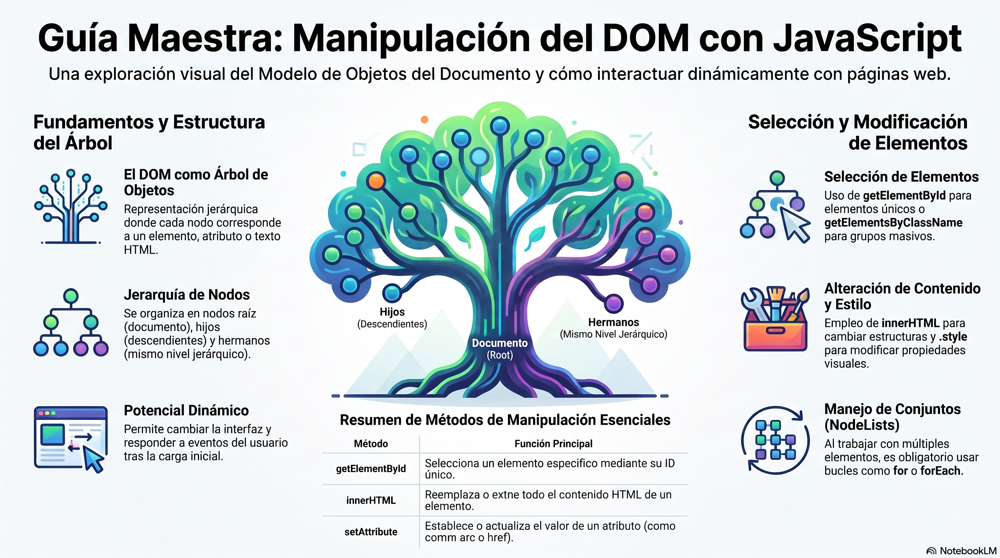

# Semana 04 — Manipulación del DOM con JavaScript

## Objetivo de la clase

Aprender a interactuar con el **Document Object Model (DOM)** desde JavaScript: seleccionar elementos, modificar sus estilos, atributos y contenido de texto, y crear nuevos elementos de forma dinámica respondiendo a eventos del usuario.

[Descargar presentación](material-clase/presentacion.pdf)
---

## ¿Qué es el DOM?

El **DOM (Document Object Model)** es la representación en memoria del HTML de una página. El navegador lo construye automáticamente cuando carga un documento. Desde JavaScript podemos **leer y modificar** esa representación en tiempo real, lo que nos permite cambiar la página sin recargarla.

```
HTML           →   Navegador parsea   →   Árbol DOM en memoria
<div id="app">                             Node: div#app
  <h1>Hola</h1>                              └── Node: h1
</div>                                              └── TextNode: "Hola"
```

---

## 1. Evento `DOMContentLoaded`

```js
window.addEventListener('DOMContentLoaded', function () {
  // Todo el código va aquí adentro
});
```

- Se dispara cuando el navegador **terminó de parsear el HTML** y construyó el árbol DOM.
- Nos garantiza que todos los elementos `<div>`, `<button>`, etc. ya existen antes de que intentemos seleccionarlos.
- Es diferente al evento `load`, que espera también imágenes y recursos externos.

---

## 2. Selección de elementos

### `getElementById()`
Selecciona **un único elemento** por su atributo `id`. Es el método más rápido.

```js
const contenedor = document.getElementById('innerCard');
const boton      = document.getElementById('buttonChangeColor');
```

### `querySelector()`
Selecciona el **primer elemento** que coincida con un selector CSS.

```js
const linea = document.querySelector('hr');        // por etiqueta
const card  = document.querySelector('.card');     // por clase
const input = document.querySelector('#nombre');   // por id
```

### `querySelectorAll()`
Selecciona **todos los elementos** que coincidan. Retorna un `NodeList`.

```js
const titulos  = document.querySelectorAll('.card-title');
const imagenes = document.querySelectorAll('img');

// Para iterar usamos forEach (NodeList lo soporta)
titulos.forEach(titulo => {
  console.log(titulo.innerText);
});
```

> **Diferencia clave:** `querySelector` → 1 elemento | `querySelectorAll` → todos (NodeList)

---

## 3. Generación dinámica de HTML con `Array.from` y `.map()`

### `Array.from({ length: N }, callback)`
Crea un arreglo de N posiciones, ejecutando el callback en cada una.

```js
const cards = Array.from({ length: 16 }, (_, i) => ({
  picture: `https://picsum.photos/300/200?random=${i + 1}`,
  title: 'Lorem ipsum dolor sit amet',
  content: 'Texto de ejemplo...'
}));
// _ → valor (lo ignoramos)   i → índice: 0, 1, 2 ... 15
```

### Renderizado eficiente con `.map().join('')`

```js
// ✅ CORRECTO: una sola escritura al DOM
const html = cards.map(card => `
  <div class="col-md-3">
    
    <h5>${card.title}</h5>
  </div>
`).join('');
contenedor.innerHTML = html;

// ❌ INEFICIENTE: re-parsea el DOM en cada iteración
cards.forEach(card => {
  contenedor.innerHTML += `<div>...</div>`; // lento con muchos elementos
});
```

---

## 4. Modificar estilos con `element.style`

```js
const titulo = document.querySelector('h1');

titulo.style.color      = 'tomato';     // cambia el color del texto
titulo.style.fontSize   = '2rem';       // cambia el tamaño de fuente
titulo.style.color      = '';           // string vacío → elimina el estilo inline
                                        //   y hereda el del CSS
```

> Las propiedades CSS con guión se escriben en **camelCase** en JS:  
> `background-color` → `backgroundColor` | `font-size` → `fontSize`

---

## 5. Modificar texto con `innerText`

```js
const titulo = document.querySelectorAll('.card-title')[2]; // tercer título (índice 2)

titulo.innerText = 'Nuevo texto';   // escribe texto (respeta el HTML, no lo interpreta)
console.log(titulo.innerText);      // lee el texto visible del elemento
```

> **Diferencia con `innerHTML`:** `innerText` trata el contenido como texto puro (seguro).  
> `innerHTML` interpreta etiquetas HTML, por lo que puede ser un riesgo de seguridad si el contenido viene del usuario.

---

## 6. Leer y modificar atributos con `getAttribute` / `setAttribute`

```js
const imagen = document.querySelectorAll('img')[2]; // tercera imagen

// Leer el valor actual de un atributo
const urlOriginal = imagen.getAttribute('src');

// Cambiar el valor de un atributo
imagen.setAttribute('src', 'https://placehold.jp/300x200.png');

// Restaurar el valor original
imagen.setAttribute('src', urlOriginal);
```

---

## 7. Crear elementos con `createElement`

El proceso tiene 3 pasos: **crear → configurar → insertar**.

```js
// 1. Crear el nodo en memoria (aún NO está en la página)
const parrafo = document.createElement('p');

// 2. Configurar el elemento
parrafo.innerText = '🎉 ¡Etiqueta creada dinámicamente!';
parrafo.classList.add('mt-3', 'text-success', 'fw-bold');

// 3. Insertar en el DOM (ahora sí aparece en la página)
const hr = document.querySelector('hr');
hr.after(parrafo);          // inserta después del <hr>
// hr.before(parrafo)       // inserta antes
// hr.parentNode.appendChild(parrafo) // inserta al final del padre
```

---

## 8. Eventos con `addEventListener`

```js
const boton = document.getElementById('miBoton');

// Sintaxis: elemento.addEventListener('tipoDeEvento', funcionCallback)
boton.addEventListener('click', miFuncion);

// La función se pasa SIN paréntesis (referencia, no llamada)
// ✅ boton.addEventListener('click', miFuncion);
// ❌ boton.addEventListener('click', miFuncion()); // se ejecutaría inmediatamente!
```

### Objeto `Event` y `preventDefault()`

```js
function miFuncion(e) {
  // 'e' es el objeto Event: contiene información sobre el evento
  e.preventDefault(); // cancela la acción por defecto del navegador
                      // En <a href="#">  →  evita el salto al inicio de la página
                      // En <form>        →  evita el envío del formulario
  console.log(e.target); // el elemento que originó el evento
}
```

---

## 9. Variables de estado (Toggle Flags)

Patrón para alternar entre dos estados con cada clic:

```js
let isColorChanged = false; // empieza en false = estado inicial

function toggleColor() {
  const titulos = document.querySelectorAll('.card-title');

  titulos.forEach(t => {
    // Ternario: si ya fue cambiado → revertir | si no → aplicar
    t.style.color = isColorChanged ? '' : 'tomato';
  });

  isColorChanged = !isColorChanged; // ! invierte: false→true, true→false
}
```

---

## 10. Scroll: mostrar/ocultar botón y desplazamiento suave

```js
const btnSubir = document.getElementById('scrollToTopBtn');

// Escuchar el evento scroll sobre la ventana completa
window.addEventListener('scroll', () => {

  // window.scrollY → píxeles desplazados verticalmente desde el inicio
  if (window.scrollY > 300) {
    btnSubir.style.display = 'block'; // mostrar botón
  } else {
    btnSubir.style.display = 'none';  // ocultar botón
  }
});

// Clic en el botón → ir suavemente al inicio
btnSubir.addEventListener('click', (e) => {
  e.preventDefault();
  window.scrollTo({
    top: 0,             // posición destino: 0px desde arriba
    behavior: 'smooth'  // animación suave en lugar de salto instantáneo
  });
});
```

---

## Resumen de métodos vistos

| Método / Propiedad | ¿Qué hace? |
|---|---|
| `getElementById('id')` | Selecciona 1 elemento por id |
| `querySelector('selector')` | Selecciona el primer elemento que coincida |
| `querySelectorAll('selector')` | Selecciona todos los elementos que coincidan |
| `element.style.propiedad` | Modifica un estilo CSS inline |
| `element.innerText` | Lee o escribe el texto visible de un elemento |
| `element.innerHTML` | Lee o escribe HTML dentro de un elemento |
| `element.getAttribute('attr')` | Lee el valor de un atributo |
| `element.setAttribute('attr', 'val')` | Modifica el valor de un atributo |
| `document.createElement('tag')` | Crea un nuevo nodo HTML en memoria |
| `element.classList.add('clase')` | Agrega una o más clases CSS al elemento |
| `nodo.after(elemento)` | Inserta un elemento justo después del nodo |
| `addEventListener('evento', fn)` | Escucha un evento en un elemento |
| `event.preventDefault()` | Cancela la acción por defecto del navegador |
| `window.scrollY` | Píxeles desplazados verticalmente |
| `window.scrollTo({ top, behavior })` | Desplaza la ventana a una posición |

---

## Proyecto de la semana

**Archivo:** `semana-04/index.html` + `assets/js/main.js`

La página genera **16 tarjetas Bootstrap** de forma dinámica desde JavaScript y expone 4 botones para practicar las operaciones fundamentales del DOM:

- **Cambiar color** → modifica `style.color` en todos los títulos (toggle)
- **Cambiar texto** → modifica `innerText` del tercer título (toggle)
- **Cambiar atributo** → modifica `src` de la tercera imagen con `setAttribute` (toggle)
- **Crear etiqueta** → crea un `<p>` con `createElement` y lo inserta con `.after()`

Además incluye un **botón flotante** que aparece tras hacer scroll de 300px y que devuelve al inicio con `scrollTo({ behavior: 'smooth' })`.
