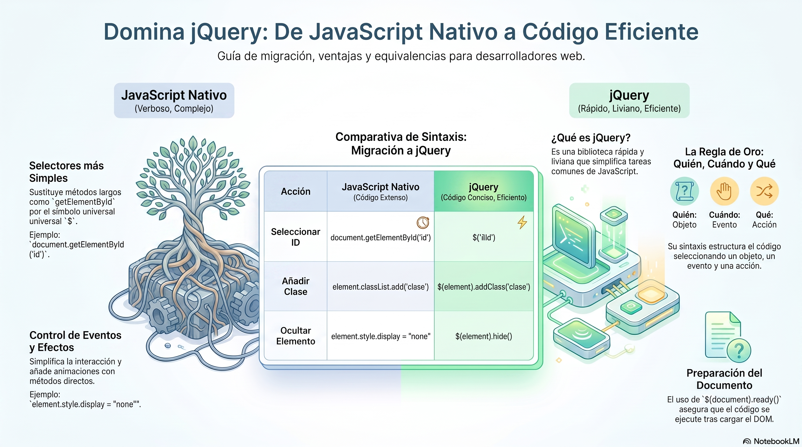

# Resumen de Clase — Semana 07
 
**Tema:** Integración de jQuery 4.0 — Selectores, Eventos, Efectos y AJAX

[Descargar presentación](material-clase/presentacion.pdf)
---

## 1. ¿Qué es jQuery y por qué usarlo?

jQuery es una **librería de JavaScript** que simplifica la manipulación del DOM, el manejo de eventos y las peticiones AJAX.

El símbolo `$` es simplemente un **alias** de la función `jQuery`:

```js
// Estas dos líneas hacen exactamente lo mismo
jQuery('p')
$('p')
```

Internamente, al final del código fuente de jQuery está esto:

```js
window.jQuery = jQuery
window.$      = jQuery   // alias corto
```

> `$` no es magia, es solo un nombre más corto para `jQuery()`.

---

## 2. Integrar jQuery 4.0 via CDN

```html
<!-- jQuery 4.0.0 CDN -->
<script
  src="https://code.jquery.com/jquery-4.0.0.min.js"
  integrity="sha256-OaVG6prZf4v69dPg6PhVattBXkcOWQB62pdZ3ORyrao="
  crossorigin="anonymous">
</script>
```

El atributo `integrity` es el hash **SRI** (Subresource Integrity): garantiza que el archivo descargado no fue alterado.

---

## 3. `$()` — Los 3 usos principales

```js
// 1. Seleccionar elementos del DOM
$('p')          // todos los <p>
$('#titulo')    // elemento con id="titulo"
$('.card')      // todos los elementos con class="card"

// 2. Envolver un elemento nativo
const el = document.getElementById('titulo')
$(el)           // ahora tiene métodos jQuery

// 3. Ejecutar código cuando el DOM está listo
$(function(){
    console.log('DOM listo')
})
```

> **Actualización jQuery 4.0:** `$(document).ready(fn)` fue eliminado. Usar siempre `$(fn)`.

---

## 4. Selección del DOM — `02-selectores-jquery.js`

| Selector | Ejemplo | Equivalente JS nativo |
|---|---|---|
| Por ID | `$('#rojo')` | `document.getElementById('rojo')` |
| Por clase | `$('.zebra')` | `document.querySelectorAll('.zebra')` |
| Por etiqueta | `$('p')` | `document.querySelectorAll('p')` |
| Por atributo | `$('[title="Google"]')` | `document.querySelector('[title="Google"]')` |

### Método `.find()`

Busca descendientes dentro de un elemento ya seleccionado:

```js
$('#caja').find('.resaltado')   // busca .resaltado dentro de #caja
```

### Agregar y quitar clases dinámicamente

```js
$('p').on('click', function(){
    let that = $(this)
    if( !that.hasClass('grande') ){
        that.addClass('grande')
    } else {
        that.removeClass('grande')
    }
})
```

---

## 5. Eventos — `03-eventos-jquery.js`

> **Actualización jQuery 4.0:** los métodos abreviados de eventos (`.click()`, `.hover()`, `.mousemove()`, etc.) fueron **eliminados**. Usar siempre `.on('evento', fn)`.

### Eventos de mouse

```js
// jQuery 3.x (ya no funciona en 4.0)
caja.hover(fnEntrar, fnSalir)

// jQuery 4.0 ✅
caja.on('mouseenter', fnEntrar).on('mouseleave', fnSalir)
```

### Eventos de formulario

```js
input.on('focus', function(){
    $(this).css({ border: '1px solid red' })
})

input.on('blur', function(){
    $(this).css({ border: '1px solid green' })
})
```

### Seguimiento del mouse

```js
$(document).on('mousemove', function(event){
    console.log(`X: ${event.clientX} / Y: ${event.clientY}`)
    $('.circle').css({
        left: event.clientX,
        top:  event.clientY
    })
})
```

---

## 6. Efectos — `05-efectos-jquery.js`

### `slideToggle()` — mostrar y ocultar con animación

```js
// Ocultar al inicio desde JS (mejor que poner display:none en el HTML)
cajaCard.hide()

mostrarOcultar.on('click', function(){
    cajaCard.slideToggle()
})
```

> Usar `.hide()` desde JS es mejor práctica: si el usuario tiene JavaScript desactivado, el contenido sigue siendo visible.

### `animate()` — animaciones personalizadas

```js
cajaAnimar.animate({ marginLeft: '500px' }, 'slow')
          .animate({ marginTop:  '100px' }, 'fast')
          .animate({ marginLeft: '0'     }, 'fast')
```

Los métodos se **encadenan** y forman una cola de animaciones.

### Problema: acumulación de clicks en el event loop

Si el usuario hace varios clicks rápidos, cada uno agrega una animación a la cola y se ejecutan todas seguidas. Solución: `.stop()`.

```js
animarcaja.on('click', function(){
    // stop(true, true):
    // → true: limpia la cola de animaciones pendientes (clearQueue)
    // → true: salta al estado final de la animación actual (jumpToEnd)
    cajaAnimar.stop(true, true).animate({ ... })
})
```

| Parámetro | Valor | Efecto |
|---|---|---|
| `clearQueue` | `true` | Elimina animaciones pendientes en la cola |
| `jumpToEnd` | `true` | Termina la animación actual en su estado final |

---

## 7. AJAX con `$.ajax()` — `06-ajak-get-jquery.js`

AJAX permite hacer peticiones HTTP **sin recargar la página**. jQuery lo simplifica con `$.ajax()`.

### Estructura básica

```js
$.ajax({
    url      : 'https://pokeapi.co/api/v2/pokemon/1',
    type     : 'GET',
    dataType : 'json',

    success: function(response) {
        console.log(response)   // datos recibidos
    },
    error: function(xhr, status) {
        alert('Error en la petición')
    },
    complete: function() {
        // se ejecuta siempre, haya error o no
    }
})
```

### Ejemplo completo — Buscador de Pokémon

```js
$(function(){

    let inputfindID = $('#numberPokeApi')
    let contentInfo = $('#dataPoke')

    // Detecta cuando el input cambia de valor
    inputfindID.on('change', (e) => {
        e.preventDefault()
        let id = inputfindID.val()
        if(id.length != 0 && id > 0){
            buscarPokemon(id)
        }
    })

    const buscarPokemon = (id) => {
        $.ajax({
            url      : `https://pokeapi.co/api/v2/pokemon/${id}`,
            type     : 'GET',
            dataType : 'json',
            success  : function(response) {

                // Objeto con los datos que nos interesan
                const infoPoke = {
                    imagen    : response.sprites.other.dream_world['front_default'],
                    especie   : response.species['name'],
                    dataMoves : response.moves
                }

                // Desestructuración para acceder más fácil
                const { imagen, especie, dataMoves } = infoPoke

                pintarPoke(imagen, especie)

                const lista = $('ul > li#dataInfo')

                // .slice(0, 10) → solo los primeros 10 movimientos
                dataMoves.slice(0, 10).forEach(mov => {
                    lista.append(`<span class="tag">${mov.move.name}</span>`)
                })
            },
            error: function() {
                alert('Hay problemas con la API')
            }
        })
    }
})
```

### `.slice(inicio, fin)` en arrays

```js
dataMoves.slice(0, 10)   // devuelve los primeros 10 elementos
dataMoves.slice(5, 10)   // devuelve del índice 5 al 9
```

> `.slice()` **no modifica** el array original, devuelve uno nuevo.

---

## 8. Tabla comparativa: jQuery 3.x vs jQuery 4.0

| Patrón | jQuery 3.x ❌ | jQuery 4.0 ✅ |
|---|---|---|
| DOM ready | `$(document).ready(fn)` | `$(fn)` |
| Hover | `.hover(fn1, fn2)` | `.on('mouseenter', fn1).on('mouseleave', fn2)` |
| Click | `.click(fn)` | `.on('click', fn)` |
| Change | `.change(fn)` | `.on('change', fn)` |
| Mousemove | `.mousemove(fn)` | `.on('mousemove', fn)` |

> **Regla de oro jQuery 4.0:** para registrar eventos, usar siempre `.on('evento', fn)`.

---

## 9. Archivos de la semana

| Archivo | Contenido |
|---|---|
| [01-integrando-jquery.html](./01-integrando-jquery.html) | Integración del CDN y document ready |
| [02-selectores-jquery.html](./02-selectores-jquery.html) | Selectores por ID, clase, atributo y `.find()` |
| [03-eventos-jquery.html](./03-eventos-jquery.html) | Eventos de mouse, foco y movimiento |
| [04-textos-jquery.html](./04-textos-jquery.html) | `.text()`, `.attr()`, `.append()`, `.each()` |
| [05-efectos-jquery.html](./05-efectos-jquery.html) | `.hide()`, `.slideToggle()`, `.animate()`, `.stop()` |
| [06-ajak-get-jquery.html](./06-ajak-get-jquery.html) | `$.ajax()` GET con PokeAPI |
